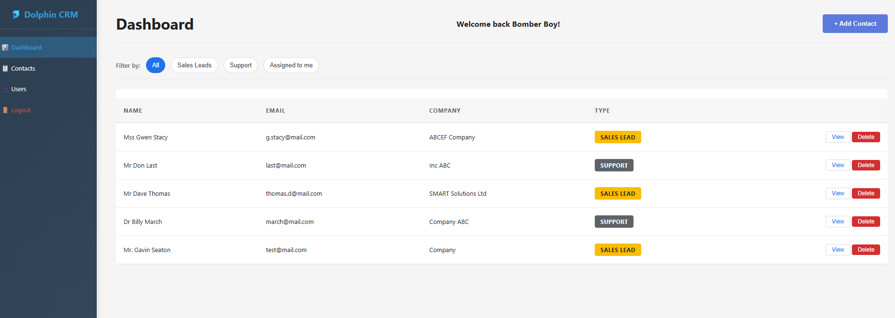
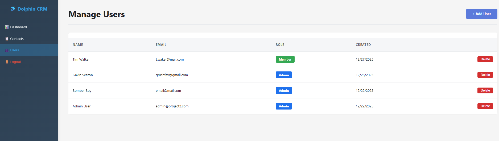
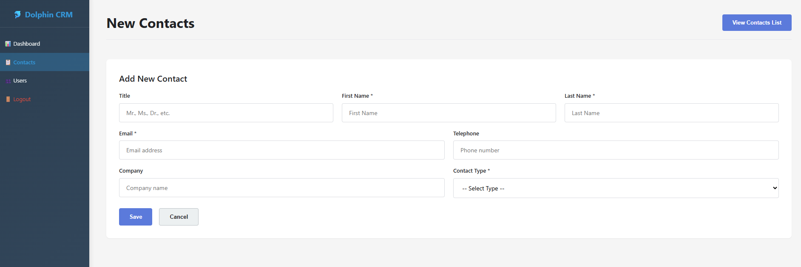
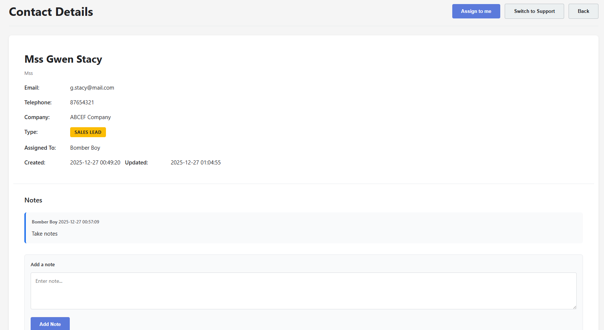

# Dolphin CRM - INFO2180 Project 2

A professional Customer Relationship Management 

# Group Members
- Gavin Seaton- 620043505
- Nathan Hansle- 620141592
- Tristan Martin- 620165414


## Features

### ✅ User Management
- **User Login** — Secure session-based authentication with password verification
- **Add Users** — Admin-only feature to create new users with password validation
  - Passwords must be at least 8 characters with uppercase, lowercase, and digit
  - Passwords are hashed using PHP's `password_hash()`
- **View Users** — Admin-only page displaying all system users in a table
  - Shows: Full name, email, role, created date
  - Role-based access control (Admin/Member)

### ✅ Contact Management
- View all contacts in a responsive list
- Add new contacts (Client or Lead type)
- View detailed contact information
- Delete contacts
- Notes system for tracking contact interactions

### ✅ Session Management
- Secure user sessions with role-based access
- Session-based authentication
- Admin-only protected pages

### Stapshot 
# Login Page

# Dashboard Page

# Manage Users Page

# New Contact Page

# Contact Detail Page



## Project Structure

```
INFO2180-PROJECT2/
├── index.html                    # Entry point (redirects to login)
├── config.php                    # Database configuration
├── login.php                     # Login page with authentication
├── users.php                     # Admin-only users list page
├── new_user.php                  # Admin-only new user form
├── logout.php                    # Session cleanup and logout
├── schema.sql                    # Database schema (MySQL-compatible)
├── api/
│   ├── get_users.php            # Get all users (admin-only)
│   ├── add_user.php             # Create new user (admin-only)
│   ├── get_contacts.php         # Get all contacts
│   ├── add_contact.php          # Create new contact
│   ├── get_contact.php          # Get single contact with notes
│   ├── delete_contact.php       # Delete contact
│   └── add_note.php             # Add note to contact
├── css/
│   └── style.css                # Main stylesheet
└── js/
    ├── login.js                 # Login form handling
    └── new_user.js              # New user form handling
```

## Setup Instructions

### 1. Database Setup

The database is created automatically during import. Run this command in PowerShell:
Edit `config.php` if needed (defaults work for XAMPP):
```php
define('DB_HOST', 'localhost');
define('DB_USER', 'admin_project2');
define('DB_PASSWORD', 'Password123');
define('DB_NAME', 'dolphin_crm');

Or, create manually in phpMyAdmin:
1. Create database: `dolphin_crm`
2. Import `schema.sql` via phpMyAdmin SQL tab

### 2. Database Setup
Copy and Paste SQL script from schema.sql to get started
-- Insert an admin user (example)
---The password below is 'adminpass' hashed using bcrypt-  password: password123
INSERT INTO `Users` (`firstname`, `lastname`, `email`, `password`, `role`)
VALUES ('Admin', 'User', 'admin@project2.com', '$2y$10$yQ1ktDd.16eHW.uTDuxcGOcDzD40gdAHirPwxk9Lefa.7cNquOOAG', 'Admin')
ON DUPLICATE KEY UPDATE `email` = `email`;
```

### 4. Start Application

1. Start XAMPP (Apache & MySQL services)
2. Navigate to: `http://localhost/INFO2180-PROJECT2/`
3. You'll be redirected to the login page

## Default Credentials

**Admin User:**
- Email: `admin@project2.com`
- Password: `password123`


### Admin Features

#### Adding Users
1. Click "New User" or go to `new_user.php`
2. Fill in the form:
   - First Name (required)
   - Last Name (required)
   - Email (required, must be unique)
   - Password (required, must meet complexity rules)
   - Role (Admin or Member)
3. Password must contain:
   - At least 8 characters
   - At least one uppercase letter
   - At least one lowercase letter
   - At least one digit
4. Click "Save"

#### Viewing Users
1. Go to `http://localhost/INFO2180-PROJECT2/users.php` (admin-only)
2. Table displays all users with:
   - Full Name
   - Email address
   - Role (color-coded: Admin=blue, Member=orange)
   - Created date and time


### Contact Management

#### Adding Contacts
1. Click "Add Contact" in sidebar
2. Fill required fields (First Name, Last Name, Email, Type)
3. Optional fields: Title, Phone, Company
4. Select type: Client or Lead
5. Click "Add Contact"

#### Viewing Contacts
1. Contacts automatically load in the list
2. Click "View Details" to see full information and notes

#### Managing Notes
1. Open contact details
2. View note history
3. Add new notes in the comment field
4. Click "Add Note"

#### Deleting Contacts
1. Click "Delete" on any contact
2. Confirm deletion

## API Endpoints

All endpoints require authentication via `$_SESSION['user_id']`. Some endpoints require admin role.

### Users Endpoints Example

#### GET `/api/get_users.php`
**Access:** Admin only  
**Returns:** List of all users

**Response:**
```json
{
  "success": true,
  "data": [
    {
      "id": 1,
      "fullname": "Admin User",
      "email": "admin@project2.com",
      "role": "Admin",
      "created_at": "2025-12-22 10:00:00"
    }
  ]
}
```

#### POST `/api/add_user.php`
**Access:** Admin only  
**Parameters:**
- `firstname` (string, required)
- `lastname` (string, required)
- `email` (string, required, unique)
- `password` (string, required)
  - Must be 8+ chars with uppercase, lowercase, digit
- `role` (string, required: 'Admin' or 'Member')

**Response:**
```json
{
  "success": true,
  "id": 2,
  "message": "User created successfully"
}
```


## Database Schema

### Users Table
```sql
CREATE TABLE Users (
    id INT PRIMARY KEY AUTO_INCREMENT,
    firstname VARCHAR(50) NOT NULL,
    lastname VARCHAR(50) NOT NULL,
    email VARCHAR(100) UNIQUE NOT NULL,
    password VARCHAR(255) NOT NULL,
    role ENUM('Admin','Member') NOT NULL DEFAULT 'Member',
    created_at TIMESTAMP DEFAULT CURRENT_TIMESTAMP
);
```

### Contacts Table
```sql
CREATE TABLE Contacts (
    id INT PRIMARY KEY AUTO_INCREMENT,
    title VARCHAR(10),
    firstname VARCHAR(50) NOT NULL,
    lastname VARCHAR(50) NOT NULL,
    email VARCHAR(100) UNIQUE NOT NULL,
    telephone VARCHAR(20),
    company VARCHAR(100),
    type ENUM('Client','Lead') NOT NULL,
    assigned_to INT REFERENCES Users(id),
    created_by INT REFERENCES Users(id),
    created_at TIMESTAMP DEFAULT CURRENT_TIMESTAMP,
    updated_at TIMESTAMP DEFAULT CURRENT_TIMESTAMP ON UPDATE CURRENT_TIMESTAMP
);
```

### Notes Table
```sql
CREATE TABLE Notes (
    id INT PRIMARY KEY AUTO_INCREMENT,
    contact_id INT NOT NULL REFERENCES Contacts(id) ON DELETE CASCADE,
    comment TEXT NOT NULL,
    created_by INT REFERENCES Users(id),
    created_at TIMESTAMP DEFAULT CURRENT_TIMESTAMP
);
```
## File Descriptions

| File | Purpose |
|------|---------|
| `config.php` | DB connection & session management |
| `login.php` | Authentication page & logic |
| `users.php` | Admin-only user list page |
| `new_user.php` | Admin user creation form |
| `logout.php` | Session cleanup |
| `api/get_users.php` | API to fetch all users |
| `api/add_user.php` | API to create users (admin-only) |
| `css/style.css` | Responsive styling |
| `js/login.js` | Login form interactions |
| `js/new_user.js` | User form validation & AJAX |


## Support & Documentation

- **README.md** — This file with full documentation
- **Code Comments** — Implementation details throughout PHP files
- **API Responses** — All endpoints return JSON with success/error status
- **Browser Console** — (F12) Shows AJAX request details for debugging


Created for INFO2180 Course Project 2 (Dec 2025)

---

**Last Updated:** December 22, 2025  
**Version:** 1.0.0